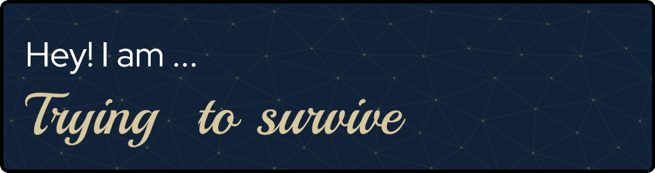

## Hey there, I'm Qilahazmi! 👋

I started my journey with a Bachelor's degree in Actuarial Science. But as life goes, I decided to take a detour… okay, maybe not a big detour, but a detour nonetheless. 😅 Now, I’m a Data Analyst by day and on a mission to transition into the land of Data Science. 🚀

To make sure I’m on the right track, I’m currently pursuing a Master's in Applied Computing. Don’t worry—I might not have a traditional Computer Science background, but that just means I have to work harder than everyone else. 💪 But hey, I'm up for the challenge, and that’s what makes this all fun, right?
What to expect from me:

    A never-ending desire to learn and break things (so I can put them back together, of course) 🛠️

    A weird love for data, algorithms, and transforming chaos into clarity 🔍

Joining a Framework-Based Software Development Course:

Well, here's what I'm guessing I might expect (because honestly, who knows what they’re getting into?):

    A whole lotta frameworks 🖤 (The good kind!)

    Getting to know the architecture of things (so I can eventually say, "Oh, that’s how the magic happens!") 🎩✨

    Learning to think like a software developer (without all the imposter syndrome that comes with it... )

I’m excited to continue on this journey, and if you're in the same boat...

Let’s learn together!
